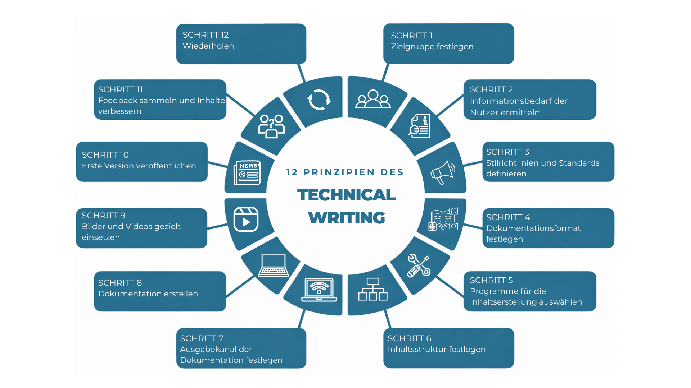

# Dokumentationsansatz (DITA-basiert)

Diese Seite beschreibt den **methodischen Dokumentationsansatz**, der im Rahmen meiner
Weiterbildung im Technical Writing vermittelt wurde, und zeigt, wie ich diesen Ansatz
in Dokumentationsprojekten praktisch anwende – von der initialen Analyse bis zur
kontinuierlichen Weiterentwicklung.

Der Ansatz orientiert sich an etablierten Prinzipien professioneller
Software-Dokumentation, mit besonderem Fokus auf **aufgabenorientierte Dokumentation**,
eine klare Informationsarchitektur und konsequent nutzerzentrierte Inhalte.

Die beschriebenen Methoden und Prinzipien werden in allen Dokumentationsbeispielen
dieses Portfolios praktisch umgesetzt, unter anderem im Projekt Windows Snipping Tool
sowie in den zugehörigen Glossaren und dem Style Guide, die im Rahmen der
Dokumentationsarbeit erstellt wurden.

---

## Methodischer Überblick

Die folgende Grafik gibt einen Überblick über die Prinzipien und Schritte, die diesem
Dokumentationsansatz zugrunde liegen und den gesamten Dokumentationslebenszyklus abbilden.

*Abbildung 1: Überblick über den im Portfolio verwendeten Dokumentationsprozess. Grafik erstellt mit PowerPoint und Canva.*

Die Grafik zeigt die zentralen Phasen des Dokumentationsprozesses – von der
Nutzeranalyse bis zur kontinuierlichen Verbesserung.

---

## Von der Nutzeranalyse zur strukturierten Dokumentation

Der Dokumentationsprozess beginnt mit einem klaren Verständnis dafür, **wer die Nutzer sind**
und **welche Ziele sie erreichen möchten** (siehe Schritte 1–3 in der Grafik).

In dieser Phase werden Zielgruppen und Nutzerrollen identifiziert, typische Aufgaben und
Nutzungsszenarien analysiert sowie Informationsbedarfe und Nutzungskontexte geklärt.

Im Rahmen des Ansatzes werden zudem frühzeitig **Style Guides, Terminologie- und
Schreibstandards** definiert, um eine konsistente Benennung von UI-Elementen, eine
einheitliche Tonalität und eine klare Struktur über alle Dokumente hinweg sicherzustellen.
Globale Style-Guides und projektspezifische Glossare unterstützen dabei die Konsistenz
und Wiederverwendbarkeit der Inhalte.

Diese Analyse bildet die Grundlage für alle weiteren Entscheidungen im Dokumentationsprozess.

---

## Informationsarchitektur und Content-Design

Die Konzeption einer klaren und logischen Informationsarchitektur ist ein zentraler
Bestandteil des vermittelten Ansatzes (Schritte 4–7 in der Grafik).

In dieser Phase werden das **Dokumentationsformat** festgelegt und geeignete
**Werkzeuge** für die Erstellung und Pflege der Inhalte ausgewählt (Schritte 4–5).

Die **Inhaltsstruktur** wird anschließend aufgabenorientiert gestaltet und basiert auf dem
**DITA-Informationsmodell**, mit einer klaren Trennung zwischen **Concept-, Task- und
Reference-Inhalten**. Diese Trennung ist nicht nur konzeptionell, sondern auch direkt in
der Struktur der einzelnen Dokumentationsseiten nachvollziehbar (Schritt 6).

Darauf aufbauend werden die **Ausgabekanäle** der Dokumentation definiert (Schritt 7),
z. B. webbasierte Hilfesysteme, In-Product-Hilfe, PDF-Dokumentation oder interne
Wissensdatenbanken, und Navigation, Terminologie und Struktur entsprechend ausgerichtet.

Dieser strukturierte Ansatz stellt sicher, dass Dokumentation verständlich, skalierbar
und langfristig gut wartbar bleibt.

---

## Schreiben, Review und kontinuierliche Verbesserung

Die Erstellung der Dokumentation erfolgt iterativ (Schritte 8–12 in der Grafik).

In dieser Phase werden Inhalte erstellt, geprüft und überarbeitet, mit Fokus auf Klarheit,
fachliche Korrektheit und Konsistenz. **Visuelle Elemente** werden gezielt eingesetzt,
wenn sie das Verständnis unterstützen. Wiederverwendbare Grafiken und UI-Elemente werden
nach Möglichkeit zentral im Referenzbereich platziert, um Redundanzen zu vermeiden und
die Wartbarkeit zu erhöhen.

Nach der Veröffentlichung fließen Feedback und Nutzungserkenntnisse kontinuierlich in die
Weiterentwicklung der Dokumentation ein. Dokumentation wird dabei als **lebendiges Produkt**
verstanden, das sich gemeinsam mit Software und Nutzeranforderungen weiterentwickelt.

---

## Zentrale Prinzipien

Über alle Dokumentationsprojekte hinweg werden folgende Prinzipien konsequent angewendet:

- Nutzerziele vor Systemfunktionen  
- Klarheit und Einfachheit als leitende Prioritäten  
- Konsistenz in Struktur, Terminologie und Stil  
- Wartbarkeit und Wiederverwendbarkeit der Inhalte  

Dieser Ansatz ermöglicht es, Dokumentation zu erstellen, die Nutzer effektiv unterstützt
und gleichzeitig nachhaltig für Entwicklungs- und Dokumentationsteams bleibt.

---

**Hinweis:** Zur Erstellung dieses Portfolios wurde *ChatGPT (Version 5.2)* als unterstützendes Werkzeug für Strukturierung und Textausarbeitung verwendet. Inhalte, Terminologie und alle beschriebenen Arbeitsschritte wurden von mir geprüft, fachlich validiert und iterativ überarbeitet.
