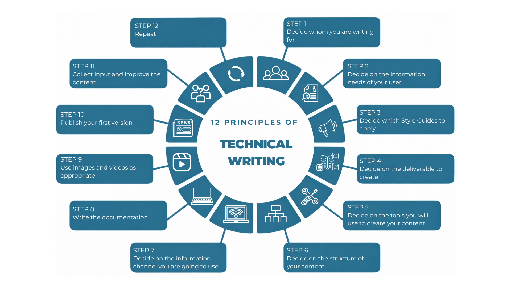

# Dokumentationsansatz (DITA-basiert)

Diese Seite beschreibt den **methodischen Dokumentationsansatz**, den ich in technischen
Dokumentationsprojekten anwende – von der initialen Analyse bis zur kontinuierlichen
Weiterentwicklung.

Der Ansatz basiert auf etablierten Prinzipien professioneller Softwaredokumentation, mit einem
klaren Fokus auf **aufgabenorientierte Dokumentation**, eine klare Informationsarchitektur und
konsequent anwenderzentrierte Inhalte.

Alle hier beschriebenen Methoden und Prinzipien werden in sämtlichen Dokumentationsbeispielen
dieses Portfolios angewendet, einschließlich der Projekte **Windows Snipping Tool** und **memoQ**
sowie der zugehörigen **Glossare** und des **Styleguides**.

---

## Methodischer Überblick

Die folgende Grafik gibt einen Überblick über die zugrunde liegenden Prinzipien und Schritte
dieses Dokumentationsansatzes und stellt den vollständigen Dokumentationslebenszyklus dar.

*Abbildung 1: Überblick über den im Portfolio verwendeten Dokumentationsprozess. Grafik erstellt mit PowerPoint und Canva.*

Die Grafik veranschaulicht die zentralen Phasen des Dokumentationsprozesses – von der
Nutzeranalyse bis zur kontinuierlichen Verbesserung.

---

## Von der Nutzeranalyse zur strukturierten Dokumentation

Der Dokumentationsprozess beginnt mit einem klaren Verständnis darüber, **wer die Nutzer sind**
und **welche Ziele sie erreichen möchten** (siehe Schritte 1–2 in der Grafik).

In dieser Phase werden Zielgruppen und Nutzerrollen definiert, typische Aufgaben und
Nutzungsszenarien analysiert sowie Informationsbedarfe und Nutzungskontexte geklärt.

Im Rahmen dieses Ansatzes werden **Styleguides, Terminologiestandards und Schreibkonventionen**
frühzeitig festgelegt, um eine konsistente Benennung von UI-Elementen, einen einheitlichen Ton
sowie eine klare Struktur in der gesamten Dokumentation sicherzustellen (Schritte 3). Globale Styleguides und projektspezifische Glossare unterstützen Konsistenz,
Wiederverwendbarkeit von Inhalten und die langfristige Wartbarkeit.

Diese Analyse bildet die Grundlage für alle weiteren Dokumentationsentscheidungen.

---

## Informationsarchitektur und Content-Design

Die Gestaltung einer klaren und logisch aufgebauten Informationsarchitektur ist ein zentraler
Bestandteil des angewendeten Ansatzes (Schritte 4–7 in der Grafik).

In dieser Phase werden das **Dokumentationsformat** festgelegt und geeignete **Werkzeuge** für
Erstellung und Pflege der Inhalte ausgewählt (Schritte 4–5).

Die **Inhaltsstruktur** wird anschließend aufgabenorientiert entworfen und basiert auf dem
**DITA-Informationsmodell** mit einer klaren Trennung von **Concept**, **Task** und
**Reference**. Diese Trennung wird sowohl konzeptionell als auch strukturell in den einzelnen
Dokumentationsthemen umgesetzt (Schritt 6).

Auf Basis dieser Struktur werden die **Ausgabekanäle** definiert (Schritt 7), beispielsweise
webbasierte Hilfesysteme, kontextbezogene Hilfe innerhalb der Software, PDF-Dokumentation oder
interne Wissensdatenbanken. Navigation, Terminologie und Struktur werden entsprechend
aufeinander abgestimmt.

Dieser strukturierte Ansatz stellt sicher, dass die Dokumentation über den gesamten
Softwarelebenszyklus hinweg verständlich, skalierbar und wartbar bleibt.

---

## Schreiben, Review und kontinuierliche Weiterentwicklung

Die Erstellung der Dokumentation erfolgt iterativ (Schritte 8–12 in der Grafik).

In dieser Phase werden Inhalte erstellt, überprüft und verfeinert, mit einem klaren Fokus auf
Verständlichkeit, technische Genauigkeit und Konsistenz. **Visuelle Elemente** werden gezielt
eingesetzt, wenn sie das Verständnis unterstützen. Wiederverwendbare Grafiken und UI-Elemente
werden, sofern möglich, zentral gepflegt, um Redundanzen zu vermeiden und die Wartbarkeit zu
verbessern.

Nach der Veröffentlichung werden Feedback und Nutzungserkenntnisse kontinuierlich in die
Weiterentwicklung der Dokumentation integriert. Dokumentation wird als **lebendes Produkt**
verstanden, das sich parallel zur Software und zu den Nutzeranforderungen weiterentwickelt.

---

## Leitprinzipien

In allen Dokumentationsprojekten werden die folgenden Prinzipien konsequent angewendet:

- Nutzerziele vor Systemfunktionen  
- Klarheit und Einfachheit als leitende Prioritäten  
- Konsistenz in Struktur, Terminologie und Stil  
- Wartbarkeit und Wiederverwendbarkeit von Inhalten  

Dieser Ansatz ermöglicht die Erstellung von Dokumentation, die Nutzer effektiv unterstützt und
gleichzeitig nachhaltig für Entwicklungs- und Dokumentationsteams bleibt.

---

**Hinweis:** *ChatGPT (Version 5.2)* wurde unterstützend für Strukturierung und Textentwürfe
eingesetzt. Sämtliche Terminologie, Inhalte und beschriebenen Workflows wurden von mir geprüft,
validiert und finalisiert.
