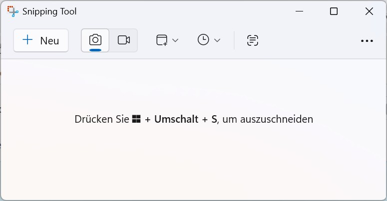

# Windows Snipping Tool
## Inhalt

1. [Was ist das Windows Snipping Tool?](#was-ist-das-windows-snipping-tool)
2. [Snipping Tool starten](#snipping-tool-starten)
3. [Ein Bildschirmfoto erstellen](#ein-bildschirmfoto-erstellen)
4. [Ein Bildschirmvideo aufnehmen](#ein-bildschirmvideo-aufnehmen)
5. [Text aus einem Bildschirmfoto kopieren](#text-aus-einem-bildschirmfoto-kopieren)
6. [Farbe vom Bildschirm bestimmen](#farbe-vom-bildschirm-bestimmen)
7. [Referenzinformationen](#referenzinformationen)
   - [Dateiformate](#dateiformate)
   - [Ausschnittbereich festlegen](#ausschnittbereich-festlegen)
   - [Tastenkombinationen](#tastenkombinationen)

---

## Was ist das Windows Snipping Tool?

Das **Windows Snipping Tool** ist eine Windows-App zum Erstellen, Bearbeiten und Speichern von 
**Bildschirmfotos** und **Bildschirmvideos**.

Mit dem Snipping Tool können Sie bestimmte Bildschirmbereiche, einzelne Fenster oder den 
gesamten Bildschirm erfassen, zum Beispiel für Dokumentations-, Kommunikations- oder 
Supportzwecke.

Diese Dokumentation beschreibt grundlegende Funktionen des Snipping Tools, wie sie unter 
**Windows 11** verfügbar sind. Einzelne Funktionen oder 
Benutzeroberflächen können je nach Windows-Version oder App-Update abweichen.

---

## Snipping Tool starten

1. Öffnen Sie die **Windows-Suche**.
2. Geben Sie **Snipping Tool** ein.
3. Klicken Sie auf **Öffnen**.

Das Snipping Tool wird gestartet und ist einsatzbereit.

### Hinweis

Alternativ können Sie die Screenshot-Funktionen auch über eine Tastenkombination starten.  
Eine Übersicht der verfügbaren Tastenkombinationen finden Sie im Abschnitt 
[*Tastenkombinationen*](#tastenkombinationen).

---

## Ein Bildschirmfoto erstellen

1. Öffnen Sie das **Snipping Tool**.
2. Stellen Sie sicher, dass der **Foto-Modus** ausgewählt ist.
   
3. (Optional) Legen Sie eine **Verzögerung** fest.
   
4. Klicken Sie auf **Neu**, um den Aufnahmemodus zu starten.
5. Wählen Sie den gewünschten **Ausschnittbereich** und markieren Sie den gewünschten **Bildschirmbereich**.

Das Bildschirmfoto wird angezeigt und kann weiterbearbeitet oder in einem unterstützten Dateiformat gespeichert werden.

### Hinweis
Weitere Informationen zur Auswahl des Ausschnittbereichs finden Sie unter [*Ausschnittbereich festlegen*](#ausschnittbereich-festlegen).

---

## Ein Bildschirmvideo aufnehmen

1. Öffnen Sie das **Snipping Tool**.
2. Wechseln Sie in der Werkzeugleiste in den **Video-Modus**.
   
3. Klicken Sie auf **Neu**, um den Aufnahmemodus zu starten.
4. Wählen Sie die gewünschte **Ausschnittbereich** und markieren Sie den gewünschten **Bildschirmbereich**.
5. Klicken Sie auf **Start**, um die Aufnahme zu starten.
6. Beenden Sie die Aufnahme über **Aufnahme beenden**.

Das Bildschirmvideo wird im Snipping Tool angezeigt und kann gespeichert werden.

### Hinweise

- Die Bildschirmaufnahme per Video ist nur in neueren Versionen des Snipping Tools verfügbar.
- Weitere Informationen zur Auswahl des Ausschnittbereichs finden Sie unter [*Ausschnittbereich festlegen*](#ausschnittbereich-festlegen).

---

## Text aus einem Bildschirmfoto kopieren

1. Öffnen Sie das **Snipping Tool**.
2. Klicken Sie im Snipping Tool auf **Text kopieren**.
   
3. Wählen Sie den Bereich, in dem sich der Text befindet.
4. Fügen Sie den Text in eine andere Anwendung ein.

Der erkannte Text steht anschließend zur weiteren Verwendung zur Verfügung.

### Hinweis

Beim Kopieren von Text aus einem Bildschirmfoto können Sie optional die 
automatische Entfernung von **Zeilenumbrüchen** aktivieren, um den Text
für die Weiterverarbeitung in anderen Anwendungen zu optimieren.

---

## Farbe vom Bildschirm bestimmen

Mit dem Farbwähler können Sie eine Farbe direkt vom Bildschirm bestimmen
und den Farbwert in anderen Anwendungen weiterverwenden, z. B. für Design-
oder Dokumentationszwecke.

1. Öffnen Sie das **Snipping Tool**.
2. Klicken Sie auf **Neu**, um den Aufnahmemodus zu starten.
3. Wählen Sie den **Farbwähler**.
4. Bewegen Sie den Mauszeiger über den gewünschten Bildschirmbereich.
5. Um den angezeigten Farbwert zu kopieren, klicken Sie auf die gewünschte Farbe.

Der Farbwert steht zur Verwendung in anderen Anwendungen (z. B. Design- oder Entwicklungswerkzeugen) zur Verfügung.

## Referenzinformationen

### Dateiformate

Das Snipping Tool unterstützt die folgenden Dateiformate:

#### Bildschirmfotos
- PNG
- JPG
- GIF

#### Bildschirmvideos
- MP4

---

### Ausschnittbereich festlegen

Über die Schaltfläche **Ausschnittbereich** legen Sie fest, welcher Bereich des Bildschirms
erfasst werden soll.

Das Snipping Tool unterstützt folgende Ausschnittbereiche:

- **Rechteck** – Aufnahme eines rechteckigen Bildschirmbereichs  
- **Fenster** – Aufnahme eines einzelnen Fensters  
- **Vollbild** – Aufnahme des gesamten Bildschirms  
- **Freihandform** – Freihändige Auswahl eines Bereichs  

---

### Tastenkombinationen

- **Windows + Shift + S** – Screenshot-Funktionen öffnen  
- **Strg + S** – Screenshot oder Video speichern  
- **Esc** – Aufnahme abbrechen  

