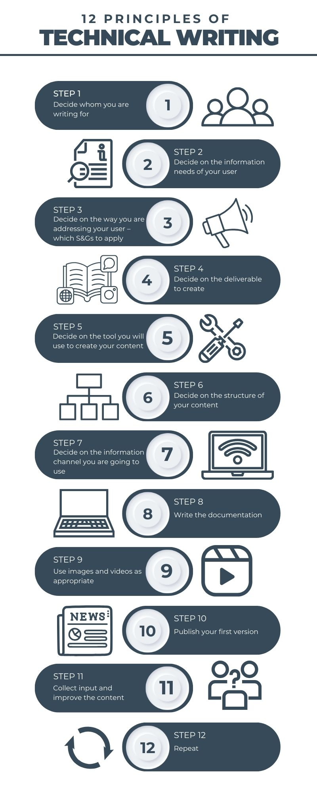

# Documentation Approach (DITA-based)

This page describes my methodological approach to technical writing and how I structure 
documentation projects from initial analysis to continuous improvement.

My work is guided by established principles of professional technical writing, with a strong 
focus on task-oriented documentation, clear information architecture, and user-centered content.

---

## Methodological Overview

The following diagram illustrates the key principles and steps that guide my documentation work 
throughout the entire documentation lifecycle.

---

## From User Analysis to Structured Content

My documentation process starts with a clear understanding of **who the users are** and 
**what they want to achieve**. Before writing any content, I focus on:

- identifying target audiences and user roles  
- understanding user goals and typical tasks  
- clarifying information needs and usage contexts  

Based on this analysis, I decide how to address users, which standards and guidelines to apply, 
and which deliverables are appropriate for the specific product and audience.

---

## Information Architecture and Content Design

A central part of my approach is designing a **clear and logical content structure** before 
writing individual topics. This includes:

- breaking down complex information into manageable units  
- structuring content around user tasks rather than system features  
- defining consistent terminology and navigation paths  

This structured approach helps ensure that documentation remains understandable, scalable, and 
easy to maintain over time.

My documentation approach is based on the DITA information model and consistently 
distinguishes between **Concept**, **Task**, and **Reference** content to ensure 
clarity, reuse, and maintainability.

---

## Writing, Review, and Continuous Improvement

Writing the documentation is an iterative process. Once a first version is created, I focus on:

- validating technical accuracy with subject matter experts  
- improving clarity, precision, and consistency  
- using visuals such as images or diagrams where they support understanding  

After publication, user feedback and usage data are used to continuously improve the content. 
Documentation is treated as a **living product**, not a one-time deliverable.

---

## Guiding Principles

Across all documentation projects, I consistently apply the following principles:

- user goals before system features  
- clarity and simplicity over completeness  
- consistency in structure, terminology, and style  
- maintainability and reusability of content  

This approach allows me to create documentation that supports users effectively while remaining 
sustainable for development and documentation teams.
