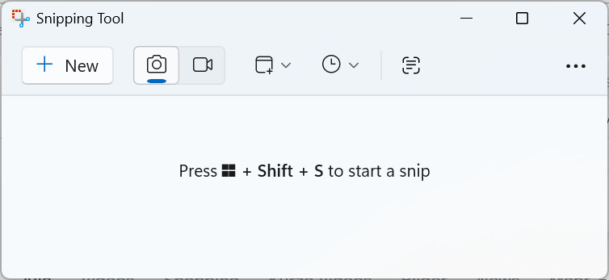
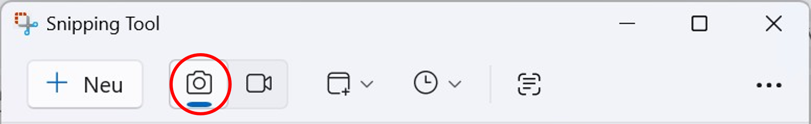
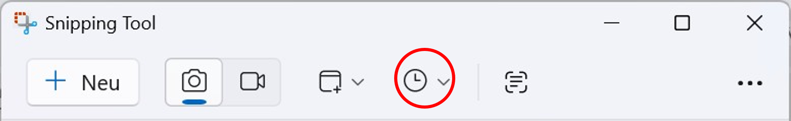
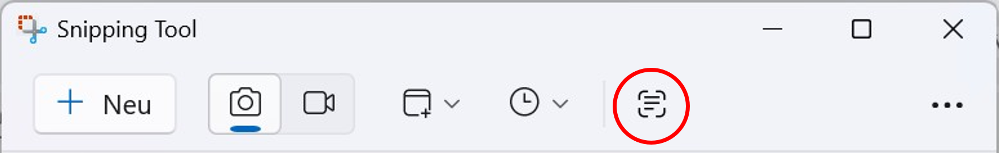
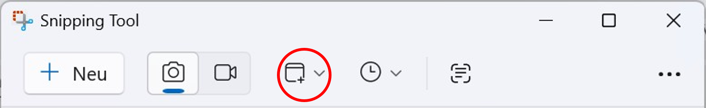

# Windows Snipping Tool

## Contents

1. [What is the Windows Snipping Tool?](#what-is-the-windows-snipping-tool)  
2. [Start the Snipping Tool](#start-the-snipping-tool)  
3. [Create a screenshot](#create-a-screenshot)  
4. [Record a screen video](#record-a-screen-video)  
5. [Copy text from a screenshot](#copy-text-from-a-screenshot)  
6. [Pick a color from the screen](#pick-a-color-from-the-screen)  
7. [Reference information](#reference-information)  
   - [File formats](#file-formats)  
   - [Select capture mode](#select-capture-mode)  
   - [Keyboard shortcuts](#keyboard-shortcuts)

---

## What is the Windows Snipping Tool?

The **Windows Snipping Tool** is a Windows application used to create, edit, and save  
**screenshots** and **screen recordings**.

With the Snipping Tool, you can capture specific areas of the screen, individual windows, or the entire screen—for example for documentation, communication, or support purposes.

This documentation describes core Snipping Tool features as available in **Windows 11**. Individual features or user interface elements may vary depending on the Windows version or application updates.

---

## Start the Snipping Tool

1. Open **Windows Search**.
2. Enter **Snipping Tool**.
3. Select **Open**.

The Snipping Tool opens and is ready to use.

### Note

You can also start screenshot functions using a keyboard shortcut.  
For an overview of available shortcuts, see [*Keyboard shortcuts*](#keyboard-shortcuts).

---

## Create a screenshot

1. Open the **Snipping Tool**.
2. Make sure **Photo mode** is selected.
   
3. (Optional) Set a **delay**.
   
4. Select **New** to start capture mode.
5. Use the **Snipping area** option to define which part of the screen is captured.

The screenshot is displayed and can be edited or saved in a supported file format.

### Note

For more information about selecting the Snipping area, see [*Select Snipping area*](#select-snipping-area).

---

## Record a screen video

1. Open the **Snipping Tool**.
2. Switch to **Video mode** in the toolbar.
   
3. Select **New** to start capture mode.
4. Use the **Snipping area** option to define which part of the screen is captured.
5. Select **Start** to begin recording.
6. End the recording by selecting **Stop recording**.

The screen video is displayed in the Snipping Tool and can be saved.

### Notes

- Screen recording is only available in newer versions of the Snipping Tool.
- For more information about selecting the Snipping area, see [*Select Snipping area*](#select-snipping-area).

---

## Copy text from a screenshot

1. Open the **Snipping Tool**.
2. Select **Text extractor**.
   
3. Select the area containing the text.
4. Paste the copied text into another application.

The recognized text is now available for further use.

### Note

When copying text from a screenshot, you can optionally **remove line breaks** to optimize the text for use in other applications.

---

## Pick a color from the screen

Using the **Color Picker**, you can select a color directly from the screen and reuse the color value in other applications—for example for design or documentation purposes.

1. Open the **Snipping Tool**.
2. Select **New** to start capture mode.
3. Select the **Color Picker**.
4. Move the pointer over the desired screen area.
5. Click to copy the displayed color value.

The color value is now available for use in other applications (for example, design or development tools).

---

## Reference information

### File formats

The Snipping Tool supports the following file formats:

#### Screenshots
- PNG  
- JPG  
- GIF  

#### Screen recordings
- MP4  

---

### Select Snipping area

Use the **Snipping area** button to define **how** the screen is captured.

The Snipping Tool supports the following Snipping areas:

- **Rectangle** – Capture a rectangular area  
- **Window** – Capture a single window  
- **Full screen** – Capture the entire screen  
- **Freeform** – Draw a freehand capture area  

---

### Keyboard shortcuts

- **Windows + Shift + S** – Open screenshot tools  
- **Ctrl + S** – Save screenshot or video  
- **Esc** – Cancel capture  

