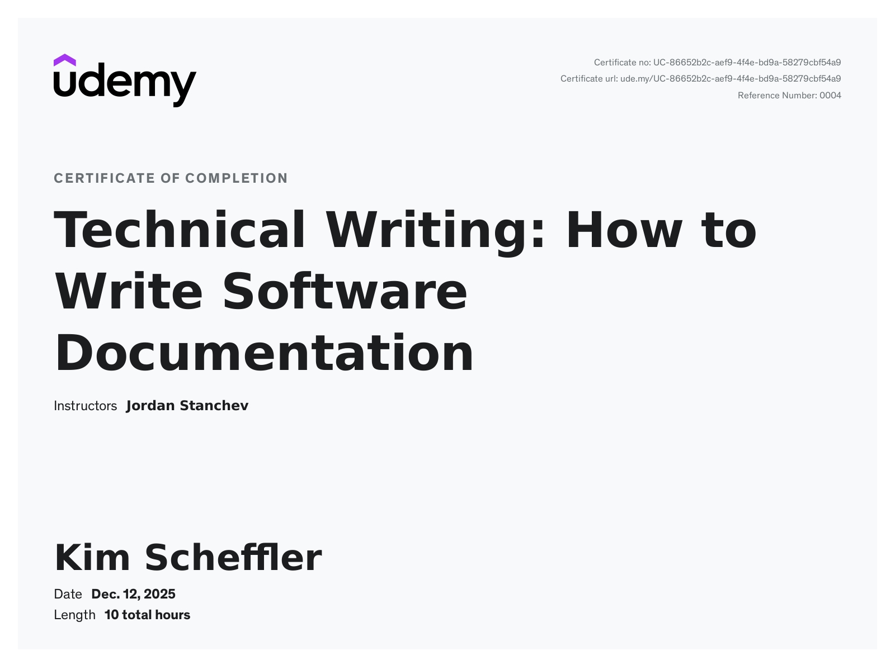

# Professional Development & Qualifications

## Technical Writing: How to Write Software Documentation  
*JPDocu School of Technical Writing*

I completed the online course **Technical Writing: How to Write Software Documentation**, a practice-oriented training program focused on modern software documentation workflows and fundamental professional methods of software documentation.

The course provides a structured introduction to documenting software products and is delivered by **Jordan Stanchev**, User Assistance Development Architect and founder of the JPDocu School of Technical Writing.

The methods and workflows taught in this course are consistently applied across the documentation examples in this portfolio (for example, the Snipping Tool, memoQ, and the Style Guide).

---

## Course content and focus areas

The course covers the fundamentals of software documentation with a strong emphasis on practical application. Key topics include:

- Fundamentals of technical writing for software products  
- Task-oriented documentation and user-centered content design  
- Writing and structuring documentation using Markdown in GitHub-based workflows  
- Fundamentals of information architecture from a technical writing perspective  
- Creating supporting graphics and diagrams using Canva  
- Quality criteria for professional software documentation  
- Basic methods of user analysis (for example, card sorting)  

The training combines video lessons, hands-on exercises, and assignments to support the direct and sustainable application of the content.
