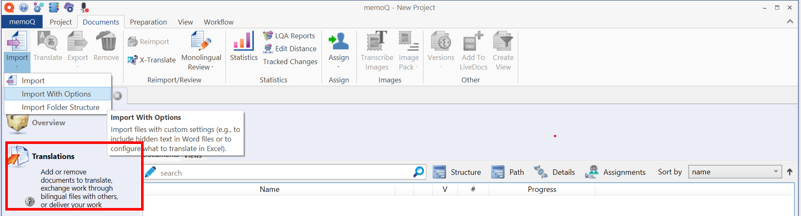
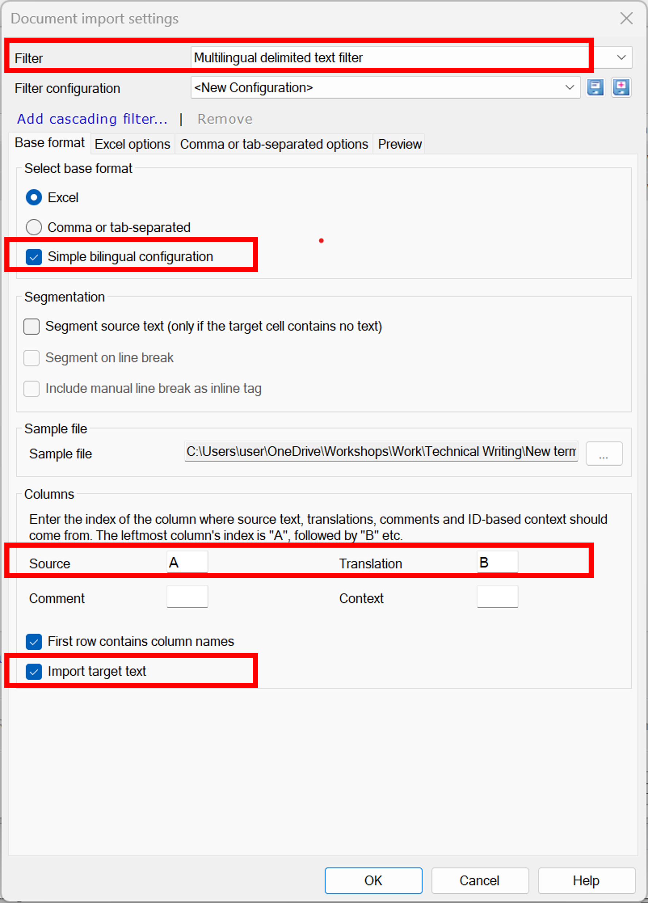
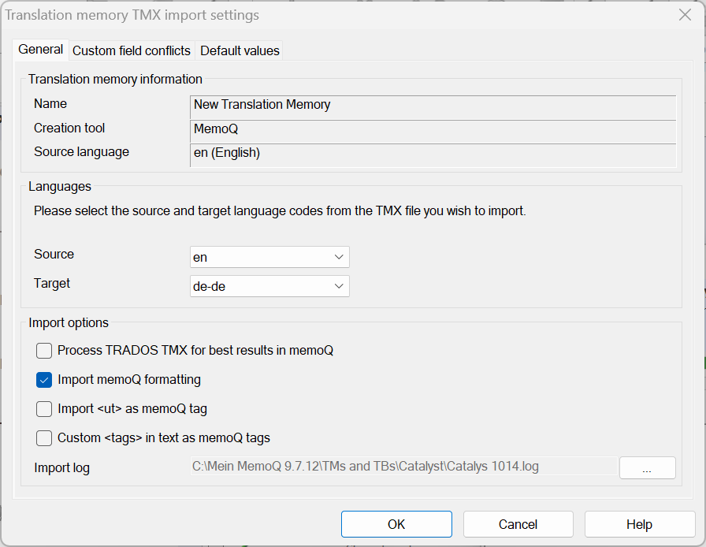
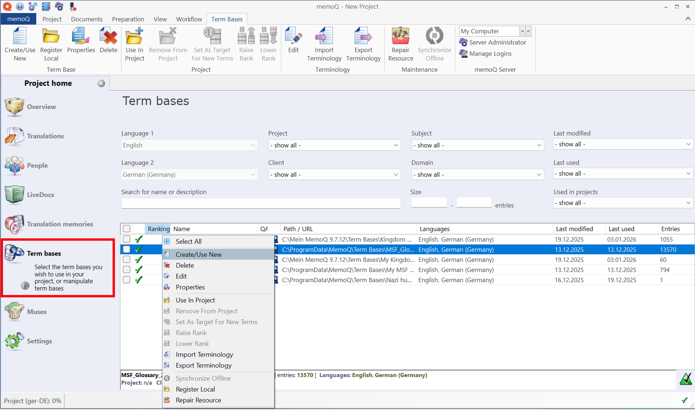
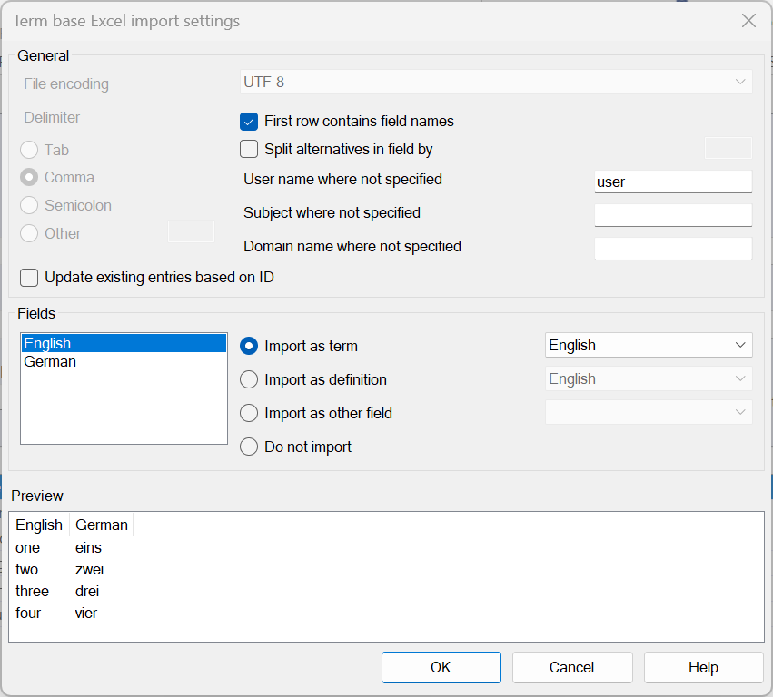
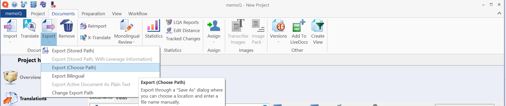

# memoQ (Version 9.7.12)

## Content

1. [What is memoQ?](#what-is-memoq)
2. [What is a memoQ project?](#what-is-a-memoq-project)
3. [Create a new memoQ project](#create-a-new-memoq-project)
4. [Add an Excel file for translation](#add-an-excel-file-for-translation)
5. [What is a Translation Memory?](#what-is-a-translation-memory)
6. [Upload a Translation Memory](#upload-a-translation-memory)
7. [What is a Term Base (Glossary)?](#what-is-a-term-base-glossary)
8. [Upload a Term Base (Glossary)](#upload-a-term-base-glossary)
9. [Add a new term to a term base while translating](#add-a-new-term-to-a-term-base-while-translating)
10. [Export a translated file](#export-a-translated-file)
11. [Reference](#reference)
    - [memoQ user interface areas](#memoq-user-interface-areas)
    - [Keyboard shortcuts (selection)](#keyboard-shortcuts-selection)

---

## What is memoQ?

**memoQ** is a professional translation environment used by translators,
reviewers, and localization teams to manage and perform translation work.

It supports the translation of multilingual content by combining source files
with linguistic resources such as **Translation Memories** and
**Term Bases (Glossaries)**.

memoQ is commonly used in professional translation workflows to support
consistency and quality across translation projects.

---

## What is a memoQ project?

A **memoQ project** is the central workspace in which all translation-related
resources and files are managed.

A project defines the source and target languages, contains the files to be
translated, and serves as the container for translation resources such as
**Translation Memories (TMs)** and **Term Bases (Glossaries)**.

All further steps in memoQ—such as assigning Translation Memories, adding Term Bases, or starting
the translation—are performed within the context of an existing project.

---

## Create a new memoQ project

This section describes how to create a new memoQ project as the basis for managing
translation files and linguistic resources.

1. Open **memoQ**.
2. From the **Dashboard**, select **New project**.
   
3. Enter a **project name** that clearly identifies the translation task.
   
4. Select the required **source language** and **target language**.
5. Click **Next** to continue in the project creation wizard.
6. Add the files to be translated, if required.
7. Click **Finish** to create the project.

The memoQ project is created and ready to be enriched with translation resources
such as **Translation Memories** and **Term Bases**.

---

## Add an Excel file for translation

### Prerequisites
- A memoQ project is created and open.
- The structure of the Excel file (source and target columns) is known.

### Steps

1. Select **Translations** in the project navigation.
    
2. Select **Import with options**.
3. Select the Excel file and click **Open**.
4. Click **Change filter and configuration**.
5. Configure the import options:
   - For **Filter**, select the **Multilingual delimited text filter**.
   - Enable **Simple bilingual configuration**.
   - Specify the **source** and **target** columns (for example, columns A and B).
   - Enable **First row contains column names**, if applicable.
   
6. Click **OK**, then **OK** again to complete the import process.

The Excel file is imported into the memoQ project and prepared for translation,
with the correct source and target columns assigned.

---

## What is a Translation Memory?

A translation memory (TM) is a database that automatically stores previously translated text segments as source–target pairs. When translating, memoQ compares new content with existing entries in the translation memory and suggests:

- exact matches
- similar (fuzzy) matches

**Using a translation memory helps translators:**

- work more efficiently
- ensure consistency across projects
- reuse existing translations for recurring content

Translation memories are typically imported into a project and assigned to the project’s language pair.

---

## Upload a Translation Memory

### Prerequisites

- A memoQ project is created and open.
- A translation memory file is available (for example, a `.tmx` file).

### Steps

1. Select **Translation memories** in the project navigation.
   
2. Right-click the TM list and select **Create/Use New**.
3. Enter a name that matches your project.
4. Right-click the new entry in the list and select **Import TM**.
5. Browse to the location of the translation memory file, select it, and confirm.
6. In **Translation memory TMX import settings**, verify the **Source** and **Target** language codes and review the import    options as needed.
   
7. Click **OK** to complete the import.

The translation memory is added to the project and can be used to automatically suggest existing translations during the translation process.

---

## What is a Term Base (Glossary)?

A term base (also called a glossary) stores **approved terminology** and its translations.

Unlike a translation memory, a term base contains individual terms, not full sentences. During translation, memoQ highlights terms from the term base to support correct and consistent terminology usage.

**Term bases are commonly used to:**

- enforce preferred terminology
- maintain consistency in technical or regulated content
- avoid incorrect or outdated term usage

Term bases are usually imported into a project and assigned to the relevant languages.

---

## Upload a Term Base (Glossary) from an Excel file

### Prerequisites
- A memoQ project is created and open.
- A term base file is available as an Excel file with source and target language columns.

### Steps

1. Select **Term bases** in the project navigation.
   
2. Right-click the term base list and select **Create/Use New**.
3. Enter a name that matches your project.
4. Right-click the new entry in the list and select **Import term base**.
5. Browse to the location of the term base file, select it, and confirm.
6. Review the **term base import settings** and map the language columns as required.
   
7. Click **OK** to complete the import.

The term base is added to the project and approved terminology is highlighted during translation to support consistent term usage.

---

## Add a new term to a term base while translating

### Prerequisites
- A translation document is open.
- A term base is available and assigned to the project.

### Steps

1. On the **Ribbon**, select **Translation**.
2. Select **Add Term**.
3. Enter the **source-language term**.
4. Enter the corresponding **target-language term**.
5. Click **OK** to save the new term.

The new term is added to the term base and will be available for term
recognition and consistency checks during translation.

### Notes

- You can use the mouse to select the English term and its corresponding German term in the text. Then select **Quick Add Term** to add the term without opening the term entry wizard.
- You can also add a term using a keyboard shortcut. See [*Keyboard shortcuts*](#keyboard-shortcuts) for details.

---

## Export a translated file

### Prerequisites
- The translation document is open and ready for delivery.
- All QA checks are resolved (for example, no missing tags or formatting issues).

### Steps

1. Select **Documents** in the project navigation.
   
2. From the menu, choose **Export**.
3. Select **Export (Choose path)**.
4. Select the destination folder for the exported file.
5. Confirm the export.

The translated file is exported to the selected location and can be uploaded to the
project system or used to replace the original source file.

---

## Reference

### memoQ user interface areas

- **Dashboard** – Start view used to create and open projects.
- **Project navigation** – Left-hand navigation area within a memoQ project.
- **Ribbon** – Top menu area containing tabs and commands.
- **Translation editor** – Central area used to translate and review segments.

---

### Keyboard shortcuts (selection)

The following keyboard shortcuts are commonly used during translation and review
in memoQ:

- **Ctrl + Enter** – Confirm segment
- **Ctrl + Shift + Enter** – Confirm segment and move to next
- **Ctrl + Z** – Undo last action
- **Ctrl + C / Ctrl + V** – Copy / paste content
- **Ctrl + F** – Search in document
- **Ctrl + E** – Add new term *(Equivalent to **Translation > Add Term**)*

