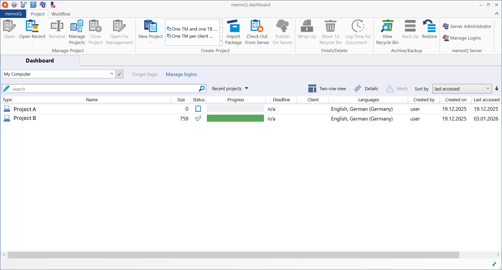
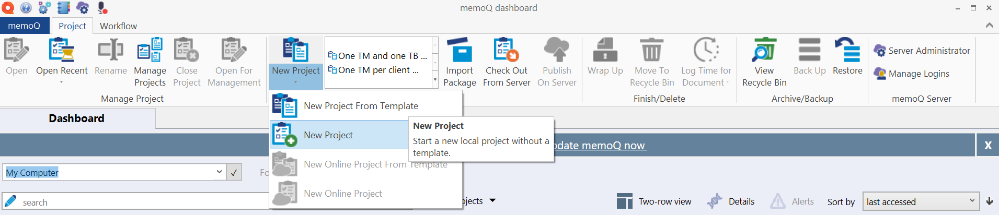
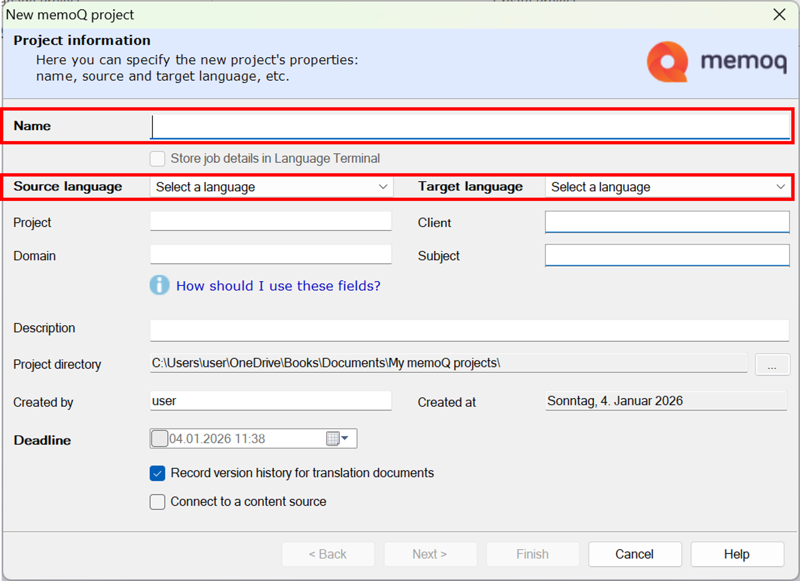
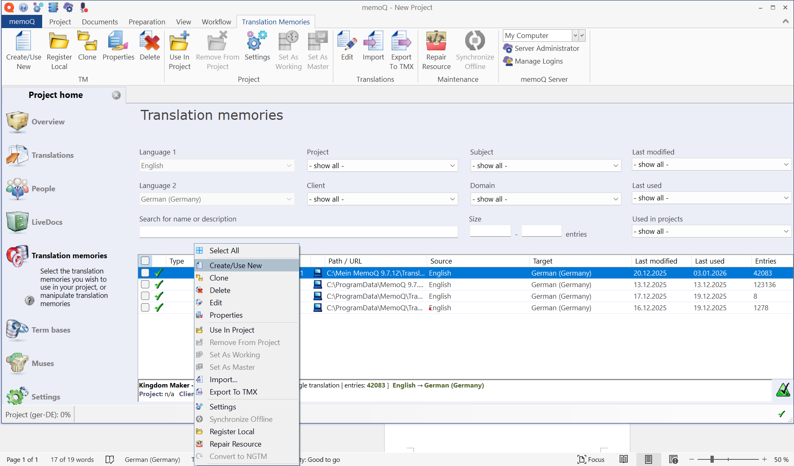

# memoQ (Version 9.12)

## Content

1. [What is memoQ?](#what-is-memoq)
2. [What is a memoQ project?](#what-is-a-memoq-project)
3. [Set up a new memoQ project](#set-up-a-new-memoQ-project)
4. [Upload a Translation Memory](#upload-a-translation-memory)
5. [Upload a Termbase (Glossary)](#upload-a-term-base-glossary)
6. 

---

## What is memoQ?

**memoQ** is a professional translation environment used by translators,
reviewers, and localization teams to manage and perform translation work.

It supports the translation of multilingual content by combining source files
with linguistic resources such as **Translation Memories (TMs)** and
**Glossaries (Term Bases)**.

memoQ is commonly used in professional translation workflows to ensure
consistency, quality, and efficiency across translation projects.

---

## What is a memoQ project?

A **memoQ project** is the central workspace in which all translation-related
resources and files are managed.

A project defines the source and target languages, contains the files to be
translated, and serves as the container for translation resources such as
**Translation Memories (TMs)** and **Glossaries (Term Bases)**.

All further steps in memoQ—such as assigning TMs, adding glossaries, or starting
the translation—are performed within the context of an existing project.

## Set up a new memoQ project

Create a new memoQ project that serves as the basis for managing translation
files and resources.

1. Open **memoQ**.
2. From the **Dashboard**, select **Create new project**.
   
3. Enter a **project name** that clearly identifies the translation task.
   
4. Select the required **source language** and **target language**.
5. Click **Next** to continue in the project creation wizard.
6. Add the files to be translated, if required.
7. Click **Finish** to create the project.

The memoQ project is created and ready to be enriched with translation resources
such as **Translation Memories** and **Glossaries**.

---

## Upload a Translation Memory

This task describes how to add an existing translation memory (TM) to a memoQ project so that previously translated content can be reused during translation.

> Voraussetzungen
> - A memoQ project is created and open.
> - A translation memory file is available (for example, a .tmx file).

1. Open the memoQ project to which you want to add the translation memory.
2. Select Translation memories in the project navigation.
   
4. Right click on the TM list and select **Create/Use New**.
5. Choose a name that matches your project.
6. Right click on new entry in the list and select **Import TM**.
7. Browse to the location of the translation memory file.
8. Select the TM file and confirm the import.
9. Assign the imported translation memory to the project languages, if prompted.

## Upload a Term Base (Glossary)
